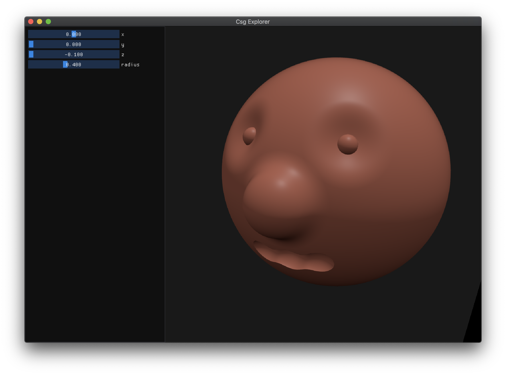

# Csg Explorer
A small library to conviniently define ... and efficiently render them.
Python bindings included!

# Example
This an example screenshot from the real-time renderer.

And this is the text file that defines the shape. It can be found in `data/test.csg`.
```python
head = sphere 0.0 0.0 -0.1 0.4

orbits = sphere 0.2 0.2 0.25 0.1
orbits += sphere -0.2 0.2 0.25 0.1
head -= 0.7 0.05 orbits

eyes = sphere 0.16 0.16 0.18 0.03
eyes += sphere -0.16 0.16 0.18 0.03
head += eyes

nose = sphere 0.0 0.0 0.3 0.1
head += 1.0 0.05 nose

mouth = sphere -0.1 -0.2 0.25 0.05
mouth += 1.0 0.05 sphere 0.0 -0.2 0.25 0.05
mouth += 1.0 0.05 sphere 0.1 -0.2 0.25 0.05
head -= mouth

```

# Python binding

```python
from pycsg import *

csg = load_csg("test.csg", False)
render(csg)
```

# Build
If you have Ninja installed.
```bash
python3 scripts/build.py release
```
Otherwise
```
mkdir build
cd build
cmake ..
make
```