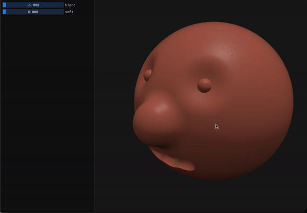

# Csg Explorer
A small library to efficiently render and define implicit shapes, described as CSGs of signed distance fields using. Python bindings included!

# Example


This is the text file that defines the shape in the example. It can be found in `data/test.csg`.
```python
# Syntax:
#   <node-name> = <add/remove> <softness> <primitive> <parameters...>
#   <node-name> += <add/remove> <softness> <other-node-name>

head = sphere 0.0 0.0 -0.1 0.4

orbits = sphere 0.2 0.2 0.25 0.1
orbits += sphere -0.2 0.2 0.25 0.1
head -= 0.7 0.05 orbits

eyes = sphere 0.16 0.16 0.18 0.03
eyes += sphere -0.16 0.16 0.18 0.03
head += eyes

nose = sphere 0.0 0.0 0.3 0.1
head += 1.0 0.05 nose

mouth = sphere -0.1 -0.2 0.25 0.05
mouth += 1.0 0.05 sphere 0.0 -0.2 0.25 0.05
mouth += 1.0 0.05 sphere 0.1 -0.2 0.25 0.05
head -= mouth

```

# Python binding
The library parser, csg evaluator and renderer can be called directly from python with no performance losses over the C++ implementation.
```python
from pycsg import *

csg = load_csg("data/test.csg")
render(csg)
```

# Build
If you have Ninja installed.
```bash
python3 scripts/build.py release
```
Otherwise
```
mkdir build
cd build
cmake ..
make
```